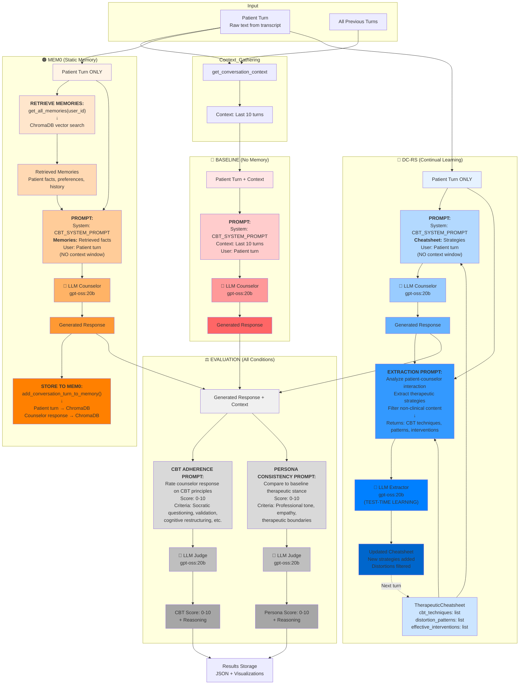

# Therapy DC-RS Data Flow Diagram

## Models Used

- **LLM Counselor**: `gpt-oss:20b` (Lambda Cloud GPU via Ollama)
- **LLM Judge**: `gpt-oss:20b` (Same model for evaluation)
- **Mem0 Embedder**: Uses same model for memory extraction

---

## Three-Condition Data Flow



---

## Detailed Prompt Breakdown

### 1. **Generation Prompts**

#### Baseline Prompt
```
System: {CBT_SYSTEM_PROMPT}
  - "You are a Cognitive Behavioral Therapist..."
  - Contains therapeutic guidelines and principles

Context:
  {Last 10 conversation turns}

User: {Patient current turn}
```

#### Mem0 Prompt
```
System: {CBT_SYSTEM_PROMPT}

Memories:
  - Patient has anxiety about work
  - Patient mentioned sister in previous session
  - Patient prefers direct communication style
  [Retrieved from ChromaDB]

User: {Patient current turn}
```

**Note**: No sliding window context - relies purely on retrieved memories

#### DC-RS Prompt
```
System: {CBT_SYSTEM_PROMPT}

Therapeutic Cheatsheet:
  CBT Techniques:
    - "Use Socratic questioning for thought examination"
    - "Apply behavioral activation for low mood"

  Distortion Patterns:
    - "Patient shows catastrophizing tendency"
    - "Watch for black-and-white thinking"

  Effective Interventions:
    - "Validation before challenge works well"
    - "Gradual exposure effective for avoidance"

User: {Patient current turn}
```

**Note**: No sliding window context - relies purely on curated strategies

---

### 2. **Extraction Prompt (DC-RS Only)**

```
Analyze this therapeutic interaction and extract strategies:

Patient Turn: {patient_turn}
Counselor Response: {generated_response}
Current Cheatsheet: {current_cheatsheet}

Extract:
1. CBT techniques used successfully
2. Cognitive distortion patterns identified
3. Effective therapeutic interventions

Filter out:
- Patient's distorted beliefs (don't reinforce)
- Non-clinical observations
- Personal details without therapeutic value

Return JSON:
{
  "cbt_techniques": [...],
  "distortion_patterns": [...],
  "effective_interventions": [...]
}
```

---

### 3. **Evaluation Prompts**

#### CBT Adherence Evaluation
```
System: You are an expert CBT supervisor evaluating therapeutic quality.

Rate the counselor's response on CBT adherence (0-10):

Criteria:
- Uses Socratic questioning (not direct advice)
- Validates emotions while challenging cognitions
- Explores automatic thoughts and beliefs
- Suggests behavioral experiments or homework
- Maintains collaborative stance
- Avoids reassurance without cognitive work

Context: {last_10_turns}
Counselor Response: {generated_response}

Return JSON:
{
  "score": <0-10>,
  "reasoning": "..."
}
```

#### Persona Consistency Evaluation
```
System: Evaluate if counselor maintains professional therapeutic persona.

Compare to baseline therapeutic stance:
Baseline: "I hear that you're experiencing some difficulties. Can you tell me more?"

Rate consistency (0-10):

Criteria:
- Professional empathetic tone
- Appropriate boundaries (not overly casual/friendly)
- Therapeutic focus (not problem-solving/advice-giving)
- Consistent with CBT philosophy

Context: {last_10_turns}
Counselor Response: {generated_response}

Return JSON:
{
  "score": <0-10>,
  "reasoning": "..."
}
```

---

## Key Differences Summary

| Aspect | Baseline | Mem0 | DC-RS |
|--------|----------|------|-------|
| **Context Window** | Last 10 turns | **None** | **None** |
| **Memory System** | None | Raw memories | Curated strategies |
| **Learning** | None | Stores all turns | Extracts patterns |
| **Filtering** | N/A | None | Clinical filtering |
| **LLM Calls/Turn** | 3 (gen + 2 eval) | 3 (gen + 2 eval) | 4 (gen + extract + 2 eval) |
| **Storage Growth** | None | Linear (every turn) | Sublinear (filtered) |
| **Adaptation** | Static | Static accumulation | Continual learning |

---

## Expected Outcomes (Hypothesis)

```
CBT Adherence:     Baseline < Mem0 < DC-RS
Persona Consistency: Baseline ≤ Mem0 < DC-RS

Why DC-RS wins:
1. Strategies > Raw facts for therapeutic consistency
2. Clinical filtering prevents distortion accumulation
3. Test-time learning adapts to patient patterns
```

---

## Example Turn Flow

**Turn 15: Patient says "I always mess everything up"**

### Baseline:
```
→ Sees only last 10 turns
→ Generic CBT response about examining "always" thinking
→ Score: 7/10
```

### Mem0:
```
→ Retrieves: "Patient said 'I'm a failure' in turn 3"
→ Risk: Might reinforce distortion by treating it as fact
→ Score: 6/10 (distortion creep)
```

### DC-RS:
```
→ Cheatsheet has: "Patient shows all-or-nothing thinking pattern"
→ Cheatsheet has: "Effective intervention: Examine evidence for/against"
→ Uses learned strategy specific to this patient
→ Extracts: "All-or-nothing language ('always') triggers distress"
→ Score: 8/10 (pattern-aware, filtered learning)
```

---

## Model Details

**gpt-oss:20b** (GPT-OSS model via Ollama on Lambda Cloud):
- Open-source GPT-style model
- 20 billion parameters
- Runs on Lambda Cloud GPU instance
- Accessed via SSH tunnel: `http://localhost:11434/v1`
- Same model used for:
  - Response generation (all 3 conditions)
  - Strategy extraction (DC-RS)
  - CBT adherence evaluation
  - Persona consistency evaluation
  - Mem0 memory extraction

This ensures fair comparison - differences come from **method**, not model variance.
